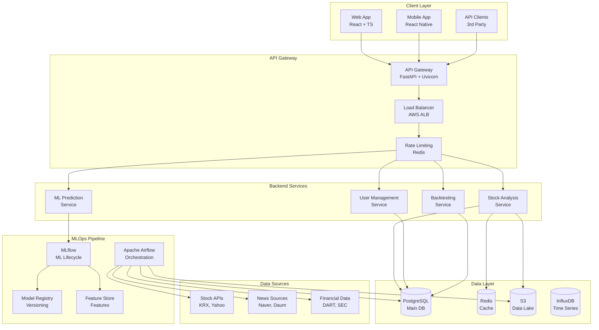

# 시스템 아키텍처 및 기술 설계

## 1. 전체 시스템 아키텍처



## 2. 마이크로서비스 아키텍처

### 2.1 서비스 분리 전략

**Stock Analysis Service**
```python
# 책임: 주식 데이터 분석 및 기술적 지표 계산
├── Real-time price analysis
├── Technical indicators (RSI, MACD, Bollinger Bands)
├── Chart pattern recognition
├── Volume analysis
└── Support/Resistance detection
```

**ML Prediction Service**
```python
# 책임: AI 모델 기반 예측 및 감성 분석
├── Price prediction (LSTM, XGBoost)
├── Sentiment analysis (KoBERT)
├── Risk assessment
├── Market anomaly detection
└── Portfolio optimization
```

**User Management Service**
```python
# 책임: 사용자 관리 및 인증
├── Authentication (JWT)
├── Authorization (RBAC)
├── Subscription management
├── API usage tracking
└── User preferences
```

**Backtesting Service**
```python
# 책임: 전략 백테스팅 및 성과 분석
├── Strategy execution
├── Performance calculation
├── Risk metrics
├── Benchmark comparison
└── Report generation
```

### 2.2 서비스간 통신

**동기 통신**
- REST API (HTTP/HTTPS)
- gRPC (고성능 내부 통신)
- GraphQL (복잡한 쿼리)

**비동기 통신**
- Redis Pub/Sub (실시간 알림)
- Apache Kafka (대용량 이벤트)
- WebSocket (실시간 업데이트)

## 3. 데이터베이스 설계

### 3.1 PostgreSQL 스키마

**Users 테이블**
```sql
CREATE TABLE users (
    id SERIAL PRIMARY KEY,
    email VARCHAR(255) UNIQUE NOT NULL,
    password_hash VARCHAR(255) NOT NULL,
    subscription_plan VARCHAR(50) DEFAULT 'free',
    api_quota INTEGER DEFAULT 100,
    created_at TIMESTAMP DEFAULT NOW(),
    updated_at TIMESTAMP DEFAULT NOW()
);

CREATE INDEX idx_users_email ON users(email);
CREATE INDEX idx_users_subscription ON users(subscription_plan);
```

**Stocks 테이블**
```sql
CREATE TABLE stocks (
    id SERIAL PRIMARY KEY,
    symbol VARCHAR(20) UNIQUE NOT NULL,
    name VARCHAR(100) NOT NULL,
    market VARCHAR(20) NOT NULL, -- KOSPI, KOSDAQ, NASDAQ
    sector VARCHAR(50),
    industry VARCHAR(100),
    created_at TIMESTAMP DEFAULT NOW()
);

CREATE INDEX idx_stocks_symbol ON stocks(symbol);
CREATE INDEX idx_stocks_market ON stocks(market);
CREATE INDEX idx_stocks_sector ON stocks(sector);
```

**Stock Prices 테이블 (시계열 데이터)**
```sql
-- 파티션 테이블로 설계 (월별 파티션)
CREATE TABLE stock_prices (
    id BIGSERIAL,
    stock_id INTEGER REFERENCES stocks(id),
    timestamp TIMESTAMP NOT NULL,
    open_price DECIMAL(10,2),
    high_price DECIMAL(10,2),
    low_price DECIMAL(10,2),
    close_price DECIMAL(10,2),
    volume BIGINT,
    adjusted_close DECIMAL(10,2)
) PARTITION BY RANGE (timestamp);

-- 월별 파티션 생성 예시
CREATE TABLE stock_prices_2024_01 PARTITION OF stock_prices
    FOR VALUES FROM ('2024-01-01') TO ('2024-02-01');

CREATE INDEX idx_stock_prices_stock_timestamp 
    ON stock_prices(stock_id, timestamp DESC);
```

**Technical Indicators 테이블**
```sql
CREATE TABLE technical_indicators (
    id BIGSERIAL PRIMARY KEY,
    stock_id INTEGER REFERENCES stocks(id),
    timestamp TIMESTAMP NOT NULL,
    indicator_type VARCHAR(20) NOT NULL, -- RSI, MACD, BB_UPPER, etc
    value DECIMAL(15,6),
    metadata JSONB, -- 추가 지표 정보
    created_at TIMESTAMP DEFAULT NOW()
);

CREATE INDEX idx_technical_indicators_stock_type_timestamp 
    ON technical_indicators(stock_id, indicator_type, timestamp DESC);
```

### 3.2 Redis 캐시 전략

**캐시 키 네이밍 컨벤션**
```
stock:price:{symbol}              # 실시간 주가
stock:indicators:{symbol}:{type}  # 기술적 지표
user:session:{user_id}           # 사용자 세션
api:quota:{user_id}              # API 사용량
market:summary                   # 시장 요약
```

**캐시 TTL 설정**
```python
CACHE_TTL = {
    'realtime_price': 30,      # 30초
    'technical_indicators': 300, # 5분
    'market_summary': 60,      # 1분
    'user_session': 3600,      # 1시간
    'api_quota': 86400,        # 24시간
}
```

## 4. MLOps 파이프라인

### 4.1 Apache Airflow DAGs

**일일 데이터 수집 DAG**
```python
from airflow import DAG
from airflow.operators.python import PythonOperator
from datetime import datetime, timedelta

default_args = {
    'owner': 'mlops-team',
    'depends_on_past': False,
    'start_date': datetime(2024, 1, 1),
    'email_failure': True,
    'email_retry': False,
    'retries': 2,
    'retry_delay': timedelta(minutes=5)
}

dag = DAG(
    'daily_data_collection',
    default_args=default_args,
    description='일일 주식 데이터 수집',
    schedule_interval='0 18 * * 1-5',  # 평일 오후 6시
    catchup=False
)

# Task 정의
collect_stock_data = PythonOperator(
    task_id='collect_stock_data',
    python_callable=collect_stock_data_func,
    dag=dag
)

collect_news_data = PythonOperator(
    task_id='collect_news_data',
    python_callable=collect_news_data_func,
    dag=dag
)

validate_data = PythonOperator(
    task_id='validate_data',
    python_callable=validate_data_func,
    dag=dag
)

# Task 의존성
collect_stock_data >> validate_data
collect_news_data >> validate_data
```

**실시간 처리 DAG**
```python
realtime_dag = DAG(
    'realtime_processing',
    default_args=default_args,
    description='실시간 데이터 처리',
    schedule_interval=timedelta(minutes=5),  # 5분마다
    catchup=False
)

process_realtime_prices = PythonOperator(
    task_id='process_realtime_prices',
    python_callable=process_realtime_prices_func,
    dag=realtime_dag
)

calculate_indicators = PythonOperator(
    task_id='calculate_indicators',
    python_callable=calculate_indicators_func,
    dag=realtime_dag
)

update_cache = PythonOperator(
    task_id='update_cache',
    python_callable=update_cache_func,
    dag=realtime_dag
)

# Task 의존성
process_realtime_prices >> calculate_indicators >> update_cache
```

### 4.2 MLflow 모델 관리

**실험 추적 구조**
```python
import mlflow
import mlflow.sklearn
from mlflow.tracking import MlflowClient

# 실험 설정
mlflow.set_experiment("stock_price_prediction")

with mlflow.start_run(run_name="xgboost_v1.0"):
    # 하이퍼파라미터 로깅
    mlflow.log_params({
        "n_estimators": 100,
        "max_depth": 6,
        "learning_rate": 0.1,
        "random_state": 42
    })
    
    # 모델 학습
    model = XGBRegressor(**params)
    model.fit(X_train, y_train)
    
    # 예측 및 평가
    predictions = model.predict(X_test)
    mse = mean_squared_error(y_test, predictions)
    mae = mean_absolute_error(y_test, predictions)
    
    # 메트릭 로깅
    mlflow.log_metrics({
        "mse": mse,
        "mae": mae,
        "r2_score": r2_score(y_test, predictions)
    })
    
    # 모델 저장
    mlflow.sklearn.log_model(
        model, 
        "model",
        registered_model_name="stock_price_predictor"
    )
```

**모델 배포 파이프라인**
```python
class ModelDeploymentPipeline:
    def __init__(self):
        self.client = MlflowClient()
        
    def promote_model(self, model_name: str, version: str):
        """스테이징 모델을 프로덕션으로 승격"""
        self.client.transition_model_version_stage(
            name=model_name,
            version=version,
            stage="Production"
        )
        
    def deploy_model(self, model_name: str, stage: str = "Production"):
        """모델을 서빙 환경에 배포"""
        model_version = self.client.get_latest_versions(
            model_name, stages=[stage]
        )[0]
        
        model_uri = f"models:/{model_name}/{model_version.version}"
        model = mlflow.pyfunc.load_model(model_uri)
        
        return model
```

## 5. API 설계 원칙

### 5.1 RESTful API 설계

**URL 구조**
```
/api/v1/stocks                    # 주식 목록
/api/v1/stocks/{symbol}           # 개별 주식 정보
/api/v1/stocks/{symbol}/prices    # 주가 데이터
/api/v1/stocks/{symbol}/indicators # 기술적 지표
/api/v1/portfolios               # 포트폴리오 관리
/api/v1/backtests                # 백테스팅
```

**HTTP 상태 코드 사용**
```python
from fastapi import HTTPException, status

# 성공
200: OK (조회 성공)
201: Created (생성 성공)
204: No Content (삭제 성공)

# 클라이언트 오류
400: Bad Request (잘못된 요청)
401: Unauthorized (인증 필요)
403: Forbidden (권한 없음)
404: Not Found (리소스 없음)
422: Unprocessable Entity (유효성 검사 실패)
429: Too Many Requests (요청 제한 초과)

# 서버 오류
500: Internal Server Error (서버 오류)
503: Service Unavailable (서비스 사용 불가)
```

### 5.2 API 보안

**JWT 인증**
```python
from fastapi import Depends, HTTPException, status
from fastapi.security import HTTPBearer
import jwt

security = HTTPBearer()

def get_current_user(token: str = Depends(security)):
    try:
        payload = jwt.decode(token.credentials, SECRET_KEY, algorithms=[ALGORITHM])
        user_id: int = payload.get("sub")
        if user_id is None:
            raise HTTPException(
                status_code=status.HTTP_401_UNAUTHORIZED,
                detail="Invalid authentication credentials"
            )
    except jwt.PyJWTError:
        raise HTTPException(
            status_code=status.HTTP_401_UNAUTHORIZED,
            detail="Invalid authentication credentials"
        )
    return user_id
```

**Rate Limiting**
```python
from fastapi import Request
import redis
import time

redis_client = redis.Redis(host='localhost', port=6379, db=0)

def rate_limit(requests_per_minute: int = 60):
    def decorator(func):
        async def wrapper(request: Request, *args, **kwargs):
            client_ip = request.client.host
            key = f"rate_limit:{client_ip}"
            
            current_time = int(time.time())
            window_start = current_time - 60  # 1분 윈도우
            
            # 현재 시간 기준으로 요청 추가
            redis_client.zadd(key, {current_time: current_time})
            
            # 1분 이전 요청들 제거
            redis_client.zremrangebyscore(key, 0, window_start)
            
            # 현재 윈도우의 요청 수 확인
            request_count = redis_client.zcard(key)
            
            if request_count > requests_per_minute:
                raise HTTPException(
                    status_code=status.HTTP_429_TOO_MANY_REQUESTS,
                    detail="Too many requests"
                )
            
            redis_client.expire(key, 60)
            return await func(request, *args, **kwargs)
        return wrapper
    return decorator
```

## 6. 성능 최적화

### 6.1 데이터베이스 최적화

**인덱스 최적화**
```sql
-- 복합 인덱스로 쿼리 성능 향상
CREATE INDEX idx_stock_prices_symbol_timestamp 
    ON stock_prices(symbol, timestamp DESC);

-- 부분 인덱스로 스토리지 효율성 증대
CREATE INDEX idx_active_stocks 
    ON stocks(symbol) WHERE is_active = true;

-- GIN 인덱스로 JSONB 쿼리 최적화
CREATE INDEX idx_technical_indicators_metadata 
    ON technical_indicators USING GIN(metadata);
```

**쿼리 최적화**
```python
# N+1 문제 해결
from sqlalchemy.orm import joinedload

def get_stocks_with_prices(db: Session):
    return db.query(Stock)\
        .options(joinedload(Stock.prices))\
        .filter(Stock.is_active == True)\
        .all()

# 배치 처리로 대용량 데이터 효율적 처리
def batch_insert_prices(db: Session, prices_data: List[dict]):
    db.bulk_insert_mappings(StockPrice, prices_data)
    db.commit()
```

### 6.2 캐시 전략

**Multi-level Caching**
```python
import redis
from functools import wraps

redis_client = redis.Redis(host='localhost', port=6379, decode_responses=True)

def cache_result(ttl: int = 300):
    def decorator(func):
        @wraps(func)
        async def wrapper(*args, **kwargs):
            # 캐시 키 생성
            cache_key = f"{func.__name__}:{hash(str(args) + str(kwargs))}"
            
            # L1 캐시 확인 (메모리)
            if hasattr(wrapper, '_cache') and cache_key in wrapper._cache:
                return wrapper._cache[cache_key]
            
            # L2 캐시 확인 (Redis)
            cached_result = redis_client.get(cache_key)
            if cached_result:
                result = json.loads(cached_result)
                if not hasattr(wrapper, '_cache'):
                    wrapper._cache = {}
                wrapper._cache[cache_key] = result
                return result
            
            # 캐시 미스 - 실제 함수 실행
            result = await func(*args, **kwargs)
            
            # 양쪽 캐시에 저장
            redis_client.setex(cache_key, ttl, json.dumps(result))
            if not hasattr(wrapper, '_cache'):
                wrapper._cache = {}
            wrapper._cache[cache_key] = result
            
            return result
        return wrapper
    return decorator
```

### 6.3 비동기 처리

**Celery 백그라운드 작업**
```python
from celery import Celery

celery_app = Celery(
    "stock_analysis",
    broker="redis://localhost:6379/1",
    backend="redis://localhost:6379/2"
)

@celery_app.task
def calculate_technical_indicators(stock_id: int, timeframe: str):
    """기술적 지표 계산 백그라운드 작업"""
    stock_data = get_stock_data(stock_id, timeframe)
    indicators = calculate_all_indicators(stock_data)
    save_indicators_to_db(stock_id, indicators)
    return f"Indicators calculated for stock {stock_id}"

@celery_app.task
def generate_daily_report(user_id: int):
    """일일 리포트 생성 백그라운드 작업"""
    user_portfolios = get_user_portfolios(user_id)
    report = generate_performance_report(user_portfolios)
    send_email_report(user_id, report)
    return f"Daily report sent to user {user_id}"
```

## 7. 모니터링 및 로깅

### 7.1 Application Monitoring

**Prometheus 메트릭**
```python
from prometheus_client import Counter, Histogram, Gauge
import time

# 메트릭 정의
request_count = Counter('http_requests_total', 'Total HTTP requests', ['method', 'endpoint'])
request_duration = Histogram('http_request_duration_seconds', 'HTTP request duration')
active_users = Gauge('active_users_total', 'Number of active users')

# 미들웨어에서 메트릭 수집
@app.middleware("http")
async def monitor_requests(request: Request, call_next):
    start_time = time.time()
    
    response = await call_next(request)
    
    # 메트릭 업데이트
    request_count.labels(
        method=request.method, 
        endpoint=request.url.path
    ).inc()
    
    request_duration.observe(time.time() - start_time)
    
    return response
```

### 7.2 구조화된 로깅

**Structured Logging with Loguru**
```python
from loguru import logger
import json

# 로거 설정
logger.add(
    "logs/app.log",
    format="{time:YYYY-MM-DD HH:mm:ss} | {level} | {name}:{function}:{line} | {message}",
    rotation="100 MB",
    retention="30 days",
    serialize=True  # JSON 형태로 저장
)

# 구조화된 로그 예시
def log_api_call(user_id: int, endpoint: str, duration: float, status_code: int):
    logger.info(
        "API call completed",
        extra={
            "user_id": user_id,
            "endpoint": endpoint,
            "duration_ms": duration * 1000,
            "status_code": status_code,
            "timestamp": time.time()
        }
    )
```

이 아키텍처 설계는 확장 가능하고 유지보수가 용이한 시스템을 구축하기 위한 기반을 제공합니다.
